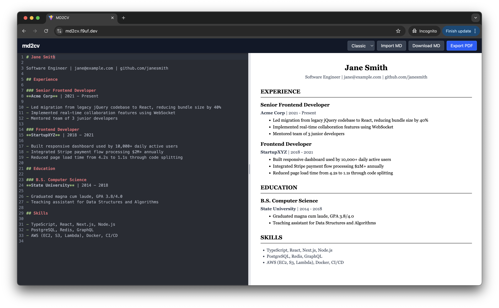

# md2cv

A personal single-page web app that lets you write your resume in Markdown and instantly see it rendered as a styled resume. All client-side — no server, no backend, no login required.



## What it does

- **Write in Markdown** — uses a familiar syntax to describe your resume structure
- **Live preview** — see the rendered resume update in real time as you type
- **Multiple templates** — switch between styled resume templates
- **Export to PDF** — download your resume directly from the browser

## Markdown structure

The parser maps Markdown elements to resume sections:

| Markdown | Resume element |
|----------|---------------|
| `# Name` | Your name / header |
| `## Section` | Section heading (Experience, Education, etc.) |
| `### Entry` | Job title, degree, or other entry |
| `- bullet` | Detail or description |

## Tech stack

- **React + Vite** — UI framework and build tool
- **TypeScript** — type safety throughout
- **Tailwind CSS** — utility-first styling
- **CodeMirror** — in-browser Markdown editor
- **markdown-it** — Markdown parsing
- **html2pdf.js / jsPDF** — client-side PDF export

## Development

```bash
npm install
npm run dev
```

Open `http://localhost:5173` in your browser.

## Build

```bash
npm run build
```

Output is in `dist/` — a fully static site you can host anywhere.
